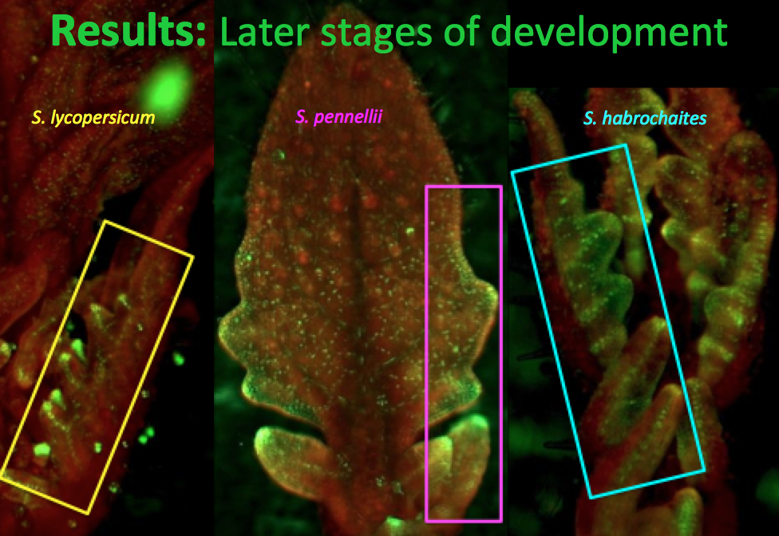

#Vein Notes: Where do I go from here?

##Part 1

1.  There is a difference in vein density between both M82 and *penn*.  
	-	*penn* has lower minor vein density.
	

	
	
2. There is a difference in response to simulated sun and simulated shade.  In both lines the sun treated plants have a higher vein density within each species. 

3. There are changes in leaf area in both species. 
	-	To a larger degree in M82.

**Hypothesis 1**: This could reflect m82 modifies vein density by increasing leaf area, while *penn* is capable of modifying the vascular density independently from leaf size changes, because the size of the leaf does not change as dramatically.

###Background Conclusions: Does this make sense so far?

In *Arabidopsis*: populations in exposed areas generally have more of a shade response than populations in wooded areas.   This hypothesized to be because those populations that are in constant shade do not have a reason to adapt a plasticity response to shade.

In Tomato: In accessions from regions that have low foliar shade (sunny) have higher shade responses (leaf length) in their oldest leaves compared with younger leaves.  

High foliar shade, like forests, the plants have a higher shade avoidance responses (leaf length) in their younger leaves. 

##Part 2 - Vein density along proximal distal axis

Minor vein density is different depending on the region on the leaf you sample. 

**M82**: There is a significant difference in vein density  between middle and top regions and to a greater extent between top and bottom.  Therefore, density is highest in the proximal regions. It should also be noted that leaf area is greatest in the proximal region, therefore this appears to be a size independent result.  Likely reflecting the distal to proximal differentiation wave. 

**penn**: There is only a significant difference between top and bottom. Again with the proximal minor vein density being higher than top. 

Also there are only differences in the proximal region when looking at simulated sun and simulated shade of M82.  Is this proximal region responsible for the significant shade/sun response found between total vein density. 

**Conclusion 2**: So overall you see a higher vein density in the proximal region, but to a more extreme in m82. When you look at the 

**Does this possibly reflect that vein development is occurring longer in the proximal region?**    How do I test this?  Brainstorm.  

##Part 3 - Density vs Area

**Q:** The big question is to ask if there is the difference in vein density maintained by just expanding the vein area?

**M82**

In Sun (possibly shade):  negative correlation between area and density in m82.  The smaller the leaf the larger the density.  

The leaf therefore is most likely responding to shade by expanding the blade area, which in turn decreases minor leaf density. 

**penn**

No correlation in minor leaflet density in penn.

It appears as though penn may be capable of responding to light differences through vein density modification independently from leaflet area changes.

##Conclusions

- There is a difference in leaf density between lines.
- There is a difference between treatments within each line.
- M82 modifies leaflet density by shape.
- Penn may be modifying by increasing density more than shape.
- *Must get a better idea of minor vein density timing. 
Confocal?*
- There is a negative correlation between circularity and vein density. 

To determine if a loci may be responsible for the differences in vein density I need to figure out the most appropriate way to statistically analyze. 
More sampling?

##Part 4 - DR5::Venus 

###Questions  Since auxin is the first precursor to vasculature formation…

Are there differences in auxin localization patterns which explain leaf differences in:

1. Vasculature   
2. Leaf Shape (roundness)   
3. Margins (serrations and lobing) 

There are two main pattern differences: When you see the bright DR5::venus strands, this is where vasculature is going to form. When there’s a diffuse signal like in this is likely to be indicative of blade outgrowth. As you can see, pen and hab have a very diffuse marginal signal, while Lyc has stong vascular fluorescence, which is not seen in the other lines.  

This diffuse marginal signal persists even later into development.  Again Lyc. Has the strongest signal, indicating where vein formation will occur. You can see strand formation in pen and hab, the signal is just much weaker. 

Again we have three young leaf primordia. Pen and hab have very weak vein signaling, while lyc’s is very strong.

**Results**
1. A diffuse marginal signal may lead to prolonged blade outgrowth, which would contribute to the rounder leaflet shape.
2. Auxin localization is not as strong in S. pennellii and S. habrochaites  for midvein and primary vein establishment. Auxin flux and concentration is known to act as an auxin sink, therefore the strong vasculature signal may act as a sink in S. lycopersicum. This causes concentrated auxin in early vein formation leading to lobing instead of blade outgrowth.

This is apparent even in fully mature leaves, As secondary vasculature is thicker.
How does auxin induce thicker vasculature?

**Future Work**:
-  Get more accurate measurements of mature vasculature through histology in more Solanum species. 
-  Compare vasculature patterning in closely related species, focusing on comparisons in lobed vs. un-lobed species.
-  Get clearer resolution of early vein formation in development using confocal microscopy. 

 

